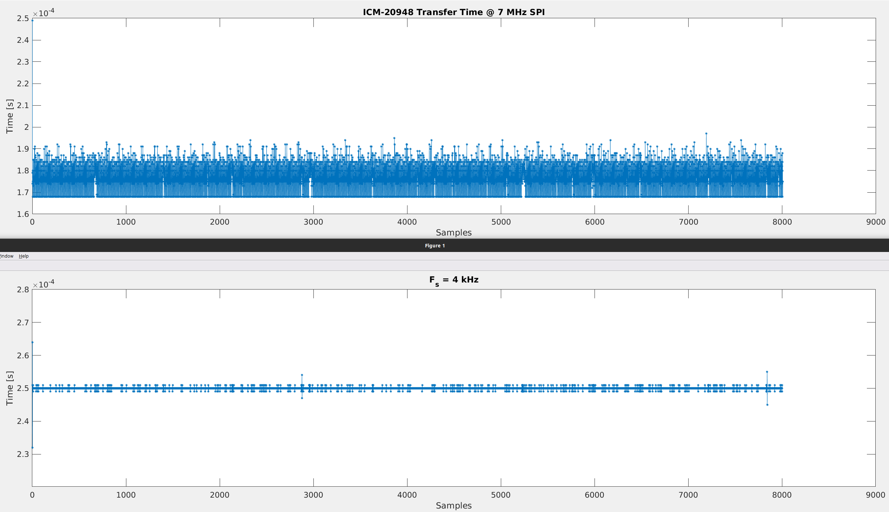

Logger
======

Sample IMU at 4 kHz and write to SD card.

ICM 20948 over SPI @ 7 MHz (max) takes ~169usec to read. SPI @ 4 MHz (default) takes ~208usec.

bottom is dt for write to SD over SPI @ 25MHz (max) (using 2.0.3-RC1) + interrupt at 4000 Hz for sampling + semaphore + ring buffer

sample jitter is 1 usec typical, 5 usec max, which i guess is pretty good, but it bothers me because RTOS is supposed to have strict timing deadlines?

### FAQ

- Why can't I sample uniformly while writing to internal flash (i.e., LittleFS/SPIFFS/FFat)? https://www.esp32.com/viewtopic.php?f=19&t=27242
